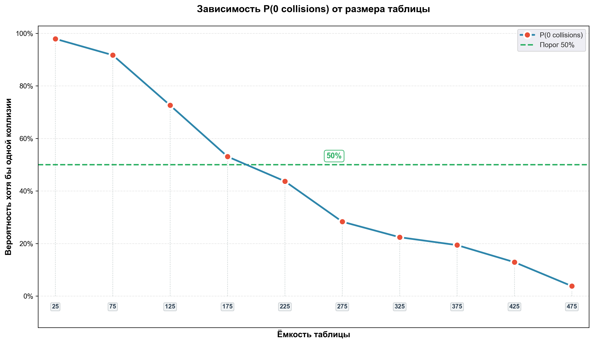

# Лабораторная работа №2 [Вариант 4]

# Общая информация по предмету

- [Ведомость](https://docs.google.com/spreadsheets/d/1p-dXrUaurP3YO4wVJEtuLHVE1OQbcSOlwukNYi67tgU)

## Задания к лабораторным работам:

1. [Первая](https://docs.google.com/document/d/1C9N6vwVPkwYdB30HtiMmJv4TLQeGkgr76lBDXUlNi3E/edit?tab=t.0)
1. [Вторая](https://docs.google.com/document/d/1W6rd17qbPZUAjxaYzdJJoHhpyZcYsc79mIaz7l6daYA/edit?usp=sharing)
1. [Третья](https://docs.google.com/document/d/1q6cqQ3-von5cO0EwXn9uWAfu41NYodNEyzR7cvQ1ZGQ/edit?usp=sharing)

## График

